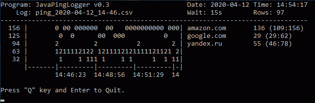

# JavaPingLogger
Программа для проверки сайтов на соединение с логированием.

## Принцип работы
Через интервал проверить список сайтов и записать в лог результат отклика.

## Возможности
- Лог файл можно открыть в Excel и использовать для диаграммы.
- Интервал и списки сайтов настраиваются.
- Есть возможность запуска с параметрами.

## Компиляция и запуск
- Для сборки и компиляции используется Maven (если не настроен [вам сюда](http://www.apache-maven.ru/install.html "Установка и настройка Maven")).
- Для запуска нужна настроенная рабочая машина Java.
- Для удобства запуска и компиляции есть скрипты BAT (в Линуксе их надо сделать исполняемыми X).
- `mvn compile assembly:single` - Через консоль создать исполняемый JAR файл.
- `mvn install` - Пересоздание проекта (будет создан EXE файл).
- `java -jar PingLogger.jar` - Запуск из консоли.
